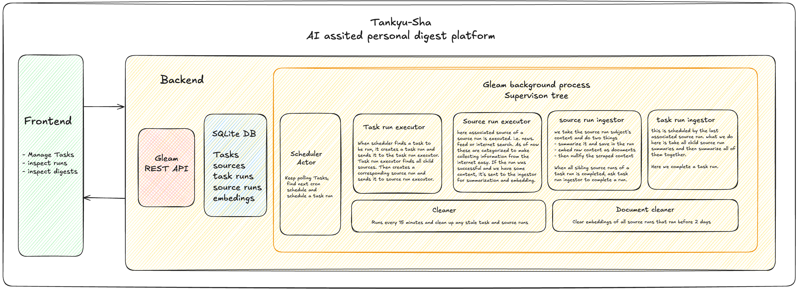

## tankyu_sha

> seeker in japaneesse

### Status

> Work is paused here and I really want to finish it off in next couple of
> months. Focusing on few different things at the moment.

### What's this ?

1. tankyu-sha is is an AI assisted personal digest tool.
2. the end goal is to keep an eye over a bunch of stuff over the internet
   without having to go to the websites.

The overral system can be seen here [plan.md](docs/plan.md), though it's not
updated in a while. will fix that

### How to run

#### Tools needed

- mise
- ollama
- have both `llama3.2:3b` plus `nomic-embed-text` models, but they can be
  changed via [config.json](priv/app_config.json)
- chrome or `bunx playwright install chromium`

#### Running

- run `mise install` to get all deps
- `mise run config:init`
- `mise run db:create`
- `mise run db:migrate`
- run `bunx playwright install` to install chromium <- rn it tries to get system
  app, has to be configurable
- now we can run `gleam run` to start the main app
- run `bun run dev` to start the web app, eventually it'll be served as part of
  the main app
- visit `http://localhost:3000/tasks`

### Roadmap (in no particular order)

- [x] flatten all actor messages to separate actors <- rn all of them are
      blocked even though we can move ahead
- [x] actor pool for all actors
- [x] keep playwright instance alive and every request is a new conetxt + tab or
      reuse same context
- [ ] Kill playwright service after cooldown period
- [x] finish search source
- [x] ~~expose all config options via UI~~ It's exposed via
      `priv/app_config.json` now, use `mise run config:init` to generate it
  - summarry model, embedding model, or maybe a model per run
  - chromium location <- useful when running outside docker
- [ ] add courier actor to send digest
- [ ] some how add a setup to monitor system memory load and throttle LLM ops +
      browser ops
- [ ] add UI for home page task + source creation
- [ ] add UI for task list
- [ ] add UI for task_runs -> source_runs
- [ ] write a Dockerfile to distribute this
